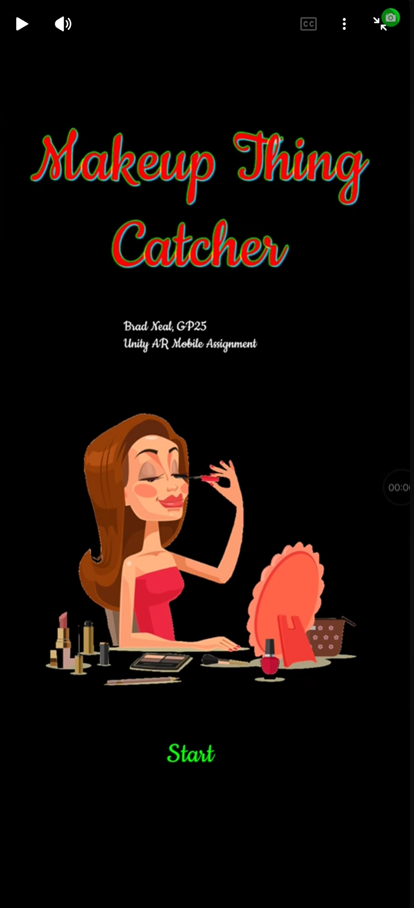
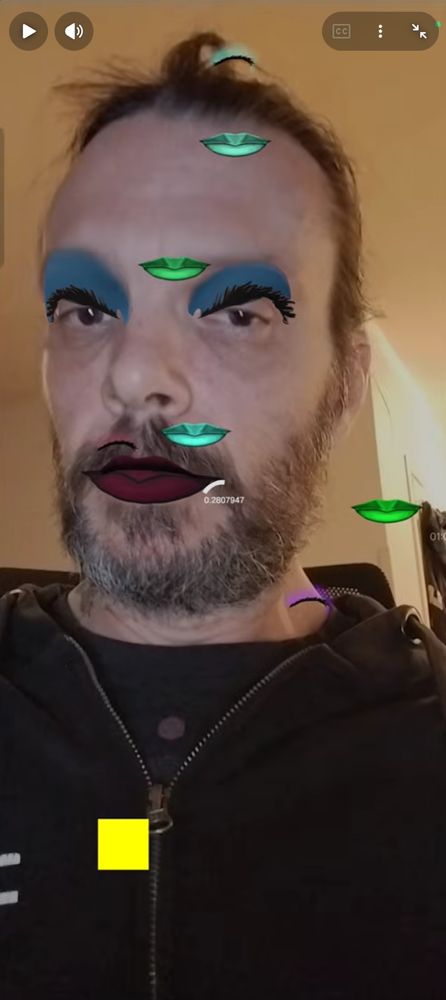

# Makeup Thing Catcher
#### Brad Neal -- GP25
#### Unity AR Mobile

### Summary

A game where you change the color of your lipstick and eyeshadow by catching things with your face.

### Scripts Authored For This Assignment
- [`ShooterFaceManager.cs`](Assets/Scripts/Shooter/ShooterFaceManager.cs)
  - Connects the ARFace object to the lips & eye makeup layers
- [`ShooterFaceLayer.cs`](Assets/Scripts/Shooter/ShooterFaceLayer.cs)
  - Contains a `MeshFilter` and `MeshRenderer` for the different visible face layers
- [`ChinMarker.cs`](Assets/Scripts//Shooter/ChinMarker.cs)
  - A simple `Transform` that keeps track of where your nose is. (Was originally going to be your chin)
- [`CanvasGun.cs`](Assets/Scripts/Shooter/CanvasGun.cs)
  - Catches the falling makeup colors. (Was originally going to be a game where you shoot cookies, but it turned into a game where you catch makeup color objects)
- [`Cookie.cs`](Assets/Scripts/Shooter/Cookie.cs)
  - Color object prefab
- [`CookiieSpawner.cs`](Assets/Scripts/Shooter/CookieSpawner.cs)
- [`ShooterUI`](Assets/Scripts/Shooter/ShooterUI.cs)
- [`MiscTools.cs`](Assets/Scripts/MiscTools.cs)
  - Junk drawer of static utilities
- Event Channels:
  - [`SO_CatchEventDataPayload.cs`](Assets/Scripts/SO_Scripts/SO_CatchEventDataPayload.cs)
  - [`SO_EventStringListPayload.cs`](Assets/Scripts/SO_Scripts/SO_EventStringListPayload.cs)

### Unity AR Mobile Classes Relevant To Face Recognition & Filtering
- `ARFaceManager`
  - Component of `XROrigin` object
  - Provides an `ARFace` to my prefab via the `FacePrefab` serialized field
- `ARFace`
  - Represents a human face detected and tracked by the device’s front-facing camera.
  - Contains all the runtime topology data for the my prefab's facial mesh

 
